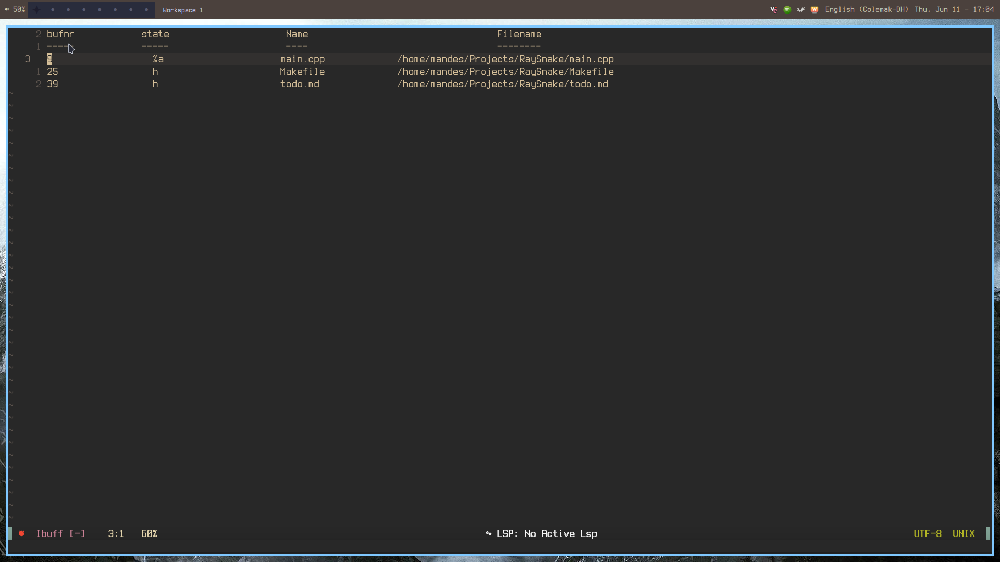

# ibuff.nvim

An Emacs ibuffer-inspired buffer manager for Neovim.

Opens a dedicated scratch buffer listing all open buffers with their number, state, name, and full path. Navigate the list with normal Vim motions, press `<Enter>` to switch to a buffer, or `q` to close the list and return to the previous buffer.



## Usage

```
:Ibuff
```

The buffer list auto-refreshes when buffers are added or removed.

## Default keybindings

| Key | Action |
|-----|--------|
| `<CR>` | Switch to buffer under cursor |
| `q` | Close ibuff and return to previous buffer |
| `d` | Delete buffer |

## Installation

Use your preferred plugin manager. Example with lazy.nvim:

```lua
{ "mandes/ibuff.nvim", lazy = false }
```
or vim.pack
```lua
vim.pack.add("https://github.com/themandes77/ibuff.nvim")
```

Call `require("ibuff").setup()` to register the `:Ibuff` command and autocommands.
